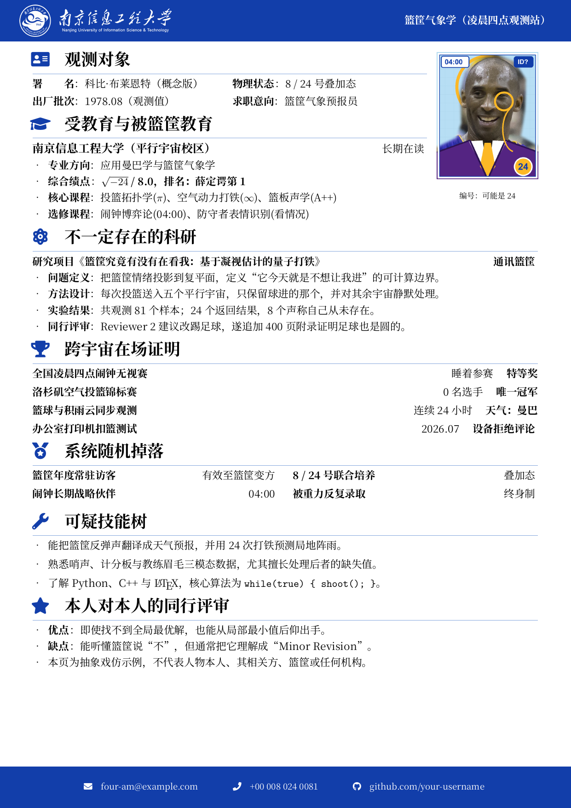

# NUIST-CV：南京信息工程大学 LaTeX 中文简历模板



这是一个可独立编译的南京信息工程大学中文简历模板。仓库内置中文字体、页眉页脚素材与一份科比主题的抽象戏仿示例，包含量子打铁、通讯篮筐、篮筐气象学，以及一张理论上符合证件照定义的照片。

> 示例履历属于戏仿内容，不代表科比·布莱恩特本人、其遗产管理方或南京信息工程大学，也不表示任何形式的授权或背书。

## 使用方法

1. 安装 TeX Live 或 MiKTeX，并确保包含 `fontawesome5`、`tikz`、`fontspec` 等常用宏包。
2. 在仓库根目录使用 XeLaTeX 编译：

   ```bash
   xelatex -interaction=nonstopmode -halt-on-error main.tex
   xelatex -interaction=nonstopmode -halt-on-error main.tex
   ```

3. 编辑 `main.tex` 中的个人信息、教育经历、项目经历等内容。
4. 将 `images/kobe-absurd-id.png` 替换为自己的照片，并同步修改文件名或引用路径。原始授权照片保留在 `images/kobe-bryant-portrait.jpg`。

## 目录结构

```text
.
├── docs/                       # GitHub 预览图
├── fonts/                      # 自包含中文字体
├── images/                     # 页眉、页脚、校标与示例肖像
├── LICENSES/                   # 第三方素材许可证文本
├── .gitignore
├── main.tex
├── main.pdf                    # 已编译示例
├── README.md
└── THIRD_PARTY_NOTICES.md
```

## 发布前检查

- 全局搜索并移除真实姓名、邮箱、手机号、学号、GitHub 用户名和项目链接。
- 删除不准备公开的成绩单、证书、源照片、编译日志和历史 PDF。
- 重新编译并检查 PDF 文档属性，确认标题、作者和关键词中没有个人信息。
- 在 GitHub 提交前运行 `git status`，只提交本仓库需要的文件。

## 来源与许可证

本模板由 [Exception0x0194/SEU-CV](https://github.com/Exception0x0194/SEU-CV) 的版式继续修改；该项目又基于 WHU 与 NPU 中文 CV 模板。第三方字体、照片与学校标识的权利状态并不相同，详情见 [THIRD_PARTY_NOTICES.md](THIRD_PARTY_NOTICES.md)。

截至 2026-07-25，上述 SEU-CV 仓库页面未提供明确的仓库级许可证，因此本仓库没有擅自添加一个覆盖全部源代码和素材的许可证。若要将其作为严格意义上的开源项目再分发，请先向上游作者确认授权，再添加兼容的项目许可证。
